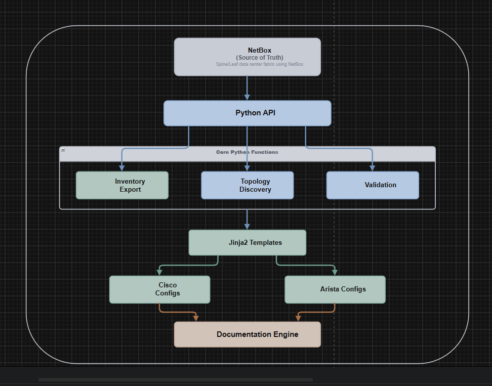
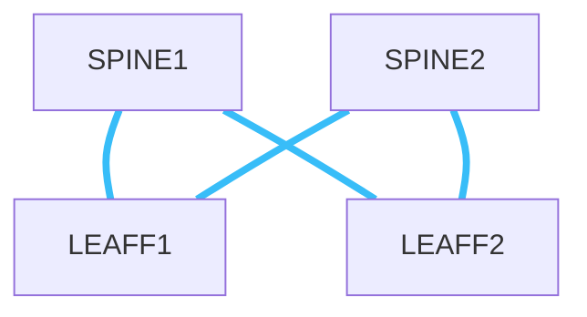
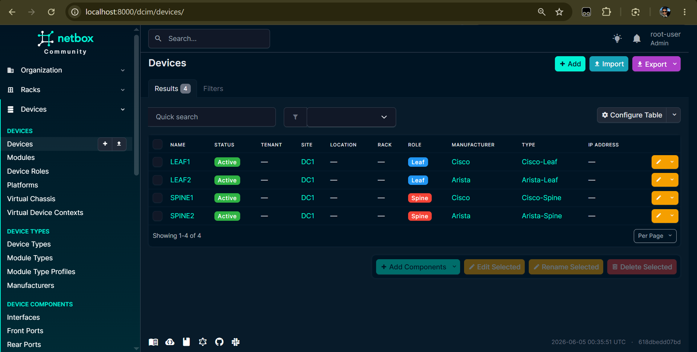
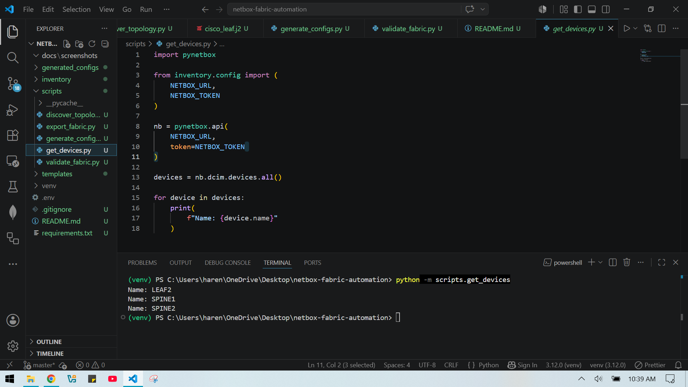
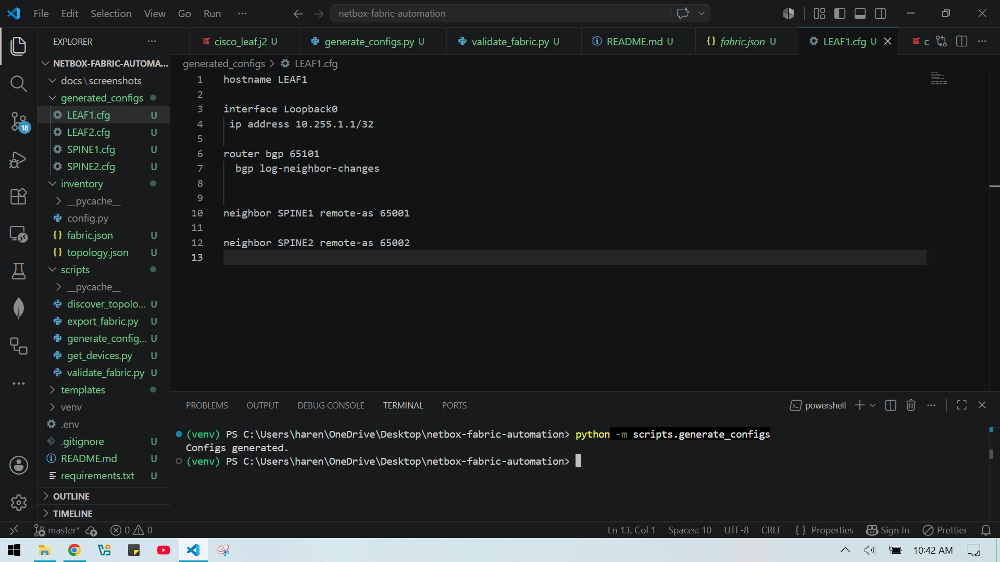
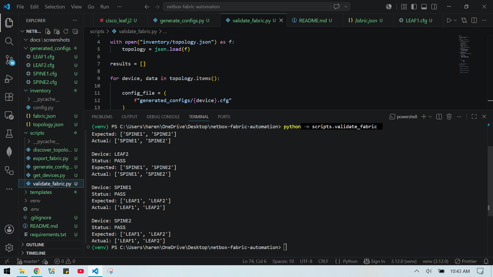
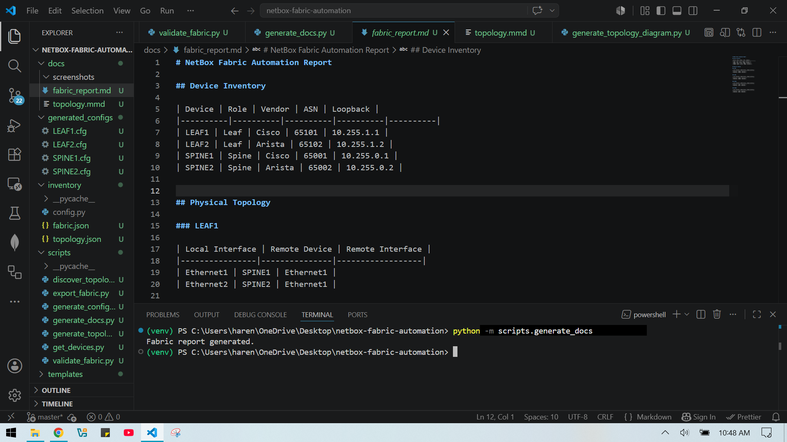
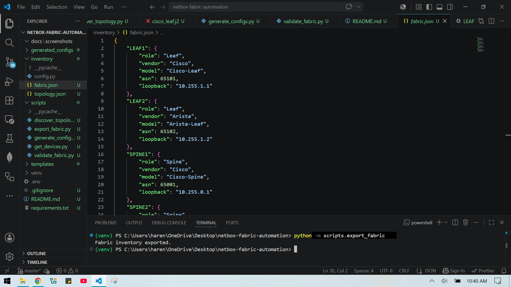

# NetBox-Driven Data Center Fabric Automation

## Overview

This project demonstrates an intent-based network automation workflow for a Spine-Leaf data center fabric using NetBox as the Single Source of Truth (SSoT).

The platform automatically discovers network infrastructure stored in NetBox, generates vendor-specific configurations for Cisco and Arista devices, validates topology consistency, and produces operational documentation without requiring manual configuration creation.

The objective was to apply Infrastructure as Code (IaC) principles to physical networking and build a repeatable deployment workflow similar to those used by large-scale cloud providers.

---

## Architecture



---


## Technologies Used

### Networking

- BGP
- Spine-Leaf Clos Architecture
- Multi-Vendor Network Design
- Intent-Based Networking Concepts

### Automation

- Python
- NetBox REST API
- Jinja2
- JSON
- Git
- GitHub

### Vendors

- Cisco
- Arista

---

## Project Objectives

- Use NetBox as a Single Source of Truth
- Eliminate manual network configuration creation
- Automatically discover physical topology
- Generate vendor-specific configurations
- Validate generated configurations against intended topology
- Automatically generate network documentation

---

## Data Center Topology


---

## Workflow

### 1. Source of Truth

Network inventory is defined in NetBox.

Stored information includes:

- Devices
- Roles
- Manufacturers
- Interfaces
- Physical cabling
- BGP ASNs

---

### 2. Inventory Discovery

Python retrieves device information directly from NetBox.

Example:

```python
devices = nb.dcim.devices.all()
```

Generated output:

```json
{
  "SPINE1": {
    "role": "Spine",
    "vendor": "Cisco",
    "asn": 65001
  }
}
```

---

### 3. Topology Discovery

Physical cabling relationships are automatically extracted from NetBox.

Example:

```json
{
  "local_interface": "Ethernet1",
  "remote_device": "LEAF1",
  "remote_interface": "Ethernet1"
}
```

---

### 4. Configuration Generation

Jinja2 templates generate vendor-specific network configurations.

Example generated configuration:

```text
hostname SPINE1

interface Loopback0
 ip address 10.255.0.1/32

router bgp 65001

 neighbor LEAF1 remote-as 65101
 neighbor LEAF2 remote-as 65102
```

---

### 5. Topology Validation

Generated configurations are validated against the intended topology stored in NetBox.

Example validation result:

```text
PASS: SPINE1
PASS: SPINE2
PASS: LEAF1
PASS: LEAF2
```

---

### 6. Documentation Generation

The platform automatically generates:

- Inventory reports
- Topology reports
- Markdown documentation
- Mermaid topology diagrams

This ensures operational documentation remains synchronized with network intent.

---

## Repository Structure

```text
netbox-fabric-automation/

docs/
├── screenshots/
├── fabric_report.md
├── topology.mmd

generated_configs/
├── SPINE1.cfg
├── SPINE2.cfg
├── LEAF1.cfg
└── LEAF2.cfg

inventory/
├── fabric.json
├── topology.json

scripts/
├── export_fabric.py
├── discover_topology.py
├── generate_configs.py
├── validate_fabric.py
├── generate_docs.py
├── generate_topology_diagram.py

templates/
├── cisco_spine.j2
├── cisco_leaf.j2
├── arista_spine.j2
└── arista_leaf.j2
```

---

## Screenshots
### NetBox Devices WEB



### NetBox Devices



### Device Topology


### Generated Configurations



### Validation Results



### NetBox Fabric Report



### NetBox Fabric JSON



---

## Key Outcomes

- Built a Source-of-Truth driven network automation workflow
- Automated inventory and topology discovery using the NetBox API
- Generated vendor-specific configurations for Cisco and Arista devices
- Implemented automated topology validation
- Automated operational documentation generation
- Applied Infrastructure as Code principles to network engineering

---

## Future Enhancements

- Nornir-based configuration deployment
- Automated change management workflow
- gNMI telemetry integration
- Prometheus-based monitoring
- CI/CD integration using GitHub Actions
- VXLAN EVPN fabric generation
- Zero-Touch Provisioning (ZTP) integration

---

## Author

Harendra Prasad Sah

CCNA | Network Security Student | Cisco NetAcad Riders 2026 Gold Winner (Australia, Fiji, New Zealand and Papua New Guinea Region)

Interested in Network Automation, Data Center Networking, Cloud Infrastructure and Network Development Engineering.
"""
